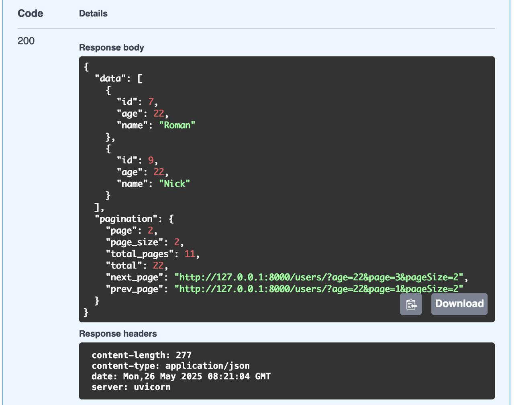
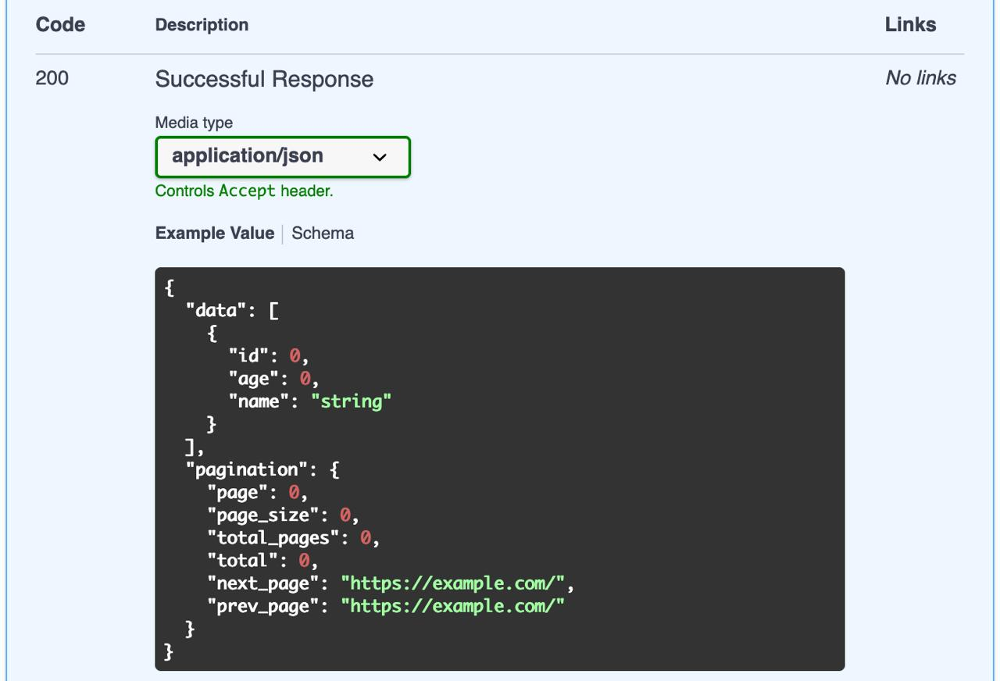

# FastAPI Ultimate Toolkit

The most useful tools for any FastAPI project

- Api
  - Pagination
    - Pagination
    - PaginationConfig
    - Paginator
    - Paginated
- Utils
  - NotSet


# Use cases

[>>> CLICK THE LINK TO SEE EXAMPLE PROJECT <<<](./example)


## Pagination


### Example 

```python
import typing as tp
from fastapi_utk import Paginated, Pagination, Paginator

from my_app import router
from my_app.response_models import User

pagination = Pagination()


@router.get("/users")
def get_users(
    paginator: tp.Annotated[Paginator, pagination.Depends()],
) -> Paginated[User]:
  total, users = get_users_from_db(...)

  return paginator(
    [
      User(
        id=user.id,
        age=user.age,
        name=user.name,
      )
      for user in users
    ],
    total=total,
  )
```

### Response



### Schema 




### Extra 

```python
import typing as tp
from fastapi_utk import Paginated, Pagination, Paginator

# Use Pagination class to specify global pagination configuration
pagination = Pagination()


# If for some routes you need non-default configuration, set it right in depends
@route.get("")
def foo(
    paginator: tp.Annotated[
        Paginator,
        pagination.Depends(
            default_page=1,  # default page number if query param is not set
            default_page_size=10,  # default page size if query param is not set
            max_page_size=100,  # maximum page size
            url_page_param="fooPage",  # query param to set a page number
            url_page_size_param="fooPageSize",  # query param to set page size, set `None` to disable this option
        )
    ]
) -> Paginated[MyModel]:    # use Paginated[...] to warp collection response 
    # ...
  
    return paginator(..., total=...)    # total is used to calculate amount of pages

# /users?fooPage=1&fooPageSize=100
```